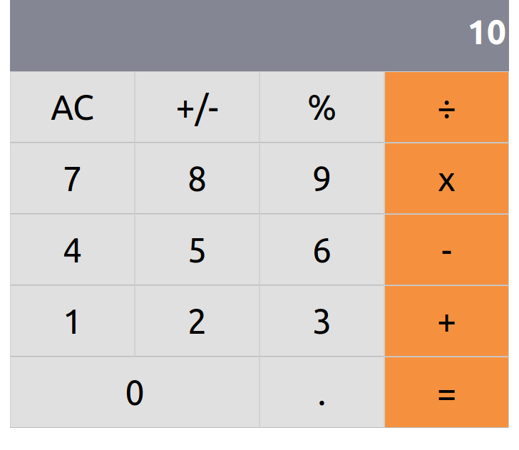

[![Contributors][contributors-shield]][contributors-url]
[![Forks][forks-shield]][forks-url]
[![Stargazers][stars-shield]][stars-url]
[![Issues][issues-shield]][issues-url]

# ReactCalc

Creating a simple calculator with React




## Table of Contents

* [Installation](#installation)
* [Built With](#built-with)
* [Contributing](#contributing)
* [Acknowledgments](#acknowledgments)
* [Authors](#author)
* [License](#license)


## Installation

You can get a local copy of the repository please run the following commands on your terminal:
```
$ cd <folder>
$ git clone git@github.com:Stricks1/ReactCalc.git
```

Run `npm install` and after `npm run build` in your terminal.

## Built With
- React
- HTML
- CSS
- Heroku

## Contributing

Contributions, issues and feature requests are welcome!

You can do it on [issues page](issues/).

## Acknowledgments

Special thanks to code reviewers.

## Show your support

Give a ⭐️ if you like this project!

## Author

👤 **Gabriel Malheiros Silveira**

- Github: [@Stricks1](https://github.com/Stricks1)
- Linkedin: [Gabriel Silveira](https://linkedin.com/in/gabriel-malheiros-silveira/)
- Twitter: [@Gabriel_Stricks](https://twitter.com/Gabriel_Stricks)

## License

<strong>Creative Commons 2020</strong>

<!-- MARKDOWN LINKS & IMAGES -->

[contributors-shield]: https://img.shields.io/github/contributors/stricks1/ReactCalc.svg?style=flat-square
[contributors-url]: https://github.com/stricks1/ReactCalc/graphs/contributors
[forks-shield]: https://img.shields.io/github/forks/stricks1/ReactCalc.svg?style=flat-square
[forks-url]: https://github.com/stricks1/ReactCalc/network/members
[stars-shield]: https://img.shields.io/github/stars/stricks1/ReactCalc.svg?style=flat-square
[stars-url]: https://github.com/stricks1/ReactCalc/stargazers
[issues-shield]: https://img.shields.io/github/issues/stricks1/ReactCalc.svg?style=flat-square
[issues-url]: https://github.com/stricks1/ReactCalc/issues
